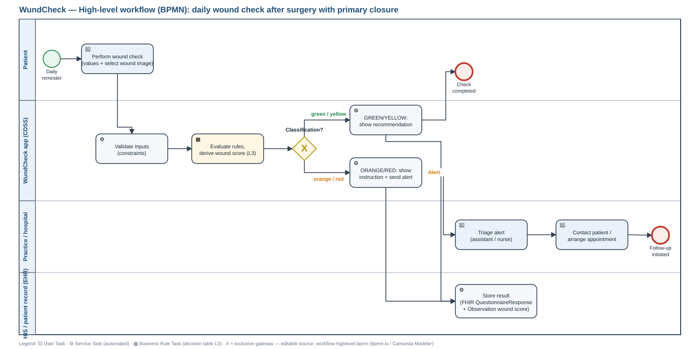
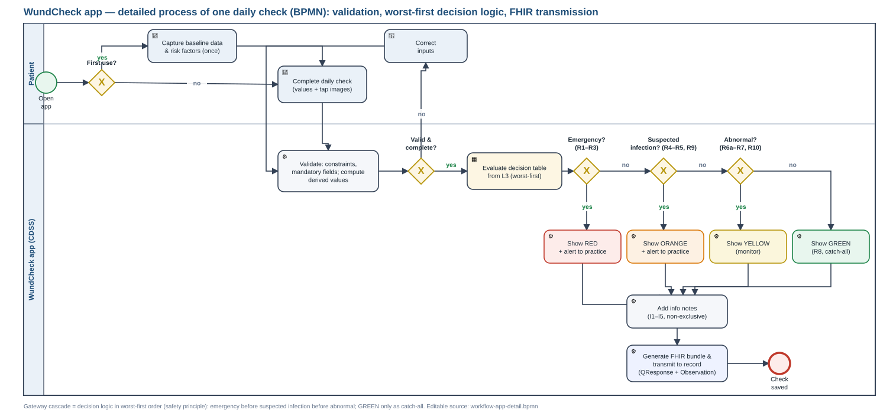

# 04 · L2 — High-level workflow (BPMN)

> **Assignment:** *“High-level workflow: diagrammatic representation of the workflow using BPMN."*

---

## 4.1 Overview

We document the workflow on **two levels**:

| Diagram | Purpose | File |
|---|---|---|
| **High-level workflow** | Interaction of all parties involved — what happens where, who does what | [`diagrams/workflow-highlevel.bpmn`](../diagrams/workflow-highlevel.bpmn) |
| **App detail process** | What happens inside the app — validation and rule cascade | [`diagrams/workflow-app-detail.bpmn`](../diagrams/workflow-app-detail.bpmn) |

Both are genuine BPMN 2.0 files, editable in [bpmn.io](https://bpmn.io) and Camunda Modeler — not a redrawn flowchart. `.svg` and `.png` versions are provided alongside for embedding in presentations.

---

## 4.2 High-level workflow



### Lanes

| Lane | Responsibility |
|---|---|
| **Patient** | Recording the daily check, acting on the recommendation |
| **WundCheck app (CDSS)** | Validation, rule evaluation, classification, transmission |
| **Practice / clinic** | Receiving and processing alerts, scheduling appointments |
| **HIS / patient record (EHR)** | Persisting the history, making it available for the follow-up consultation |

### BPMN elements used

| Element | Count | Where used |
|---|---|---|
| Start Event | 1 | Daily reminder to the patient |
| **User Task** | 3 | Activities involving humans (complete the check, process the alert, schedule an appointment) |
| **Service Task** | 4 | Automated system actions (FHIR transmission, alert dispatch, persistence) |
| **Business Rule Task** | 1 | **Core element:** "Evaluate rules" — execution of the decision table from the L3 |
| **Exclusive Gateway** | 1 | "Classification?" — branches into the four traffic-light paths |
| End Event | 2 | Check completed (green/yellow) · case handed over to the practice (orange/red) |
| Sequence Flow | 12 | All connections, labelled at the gateways |

### Process flow

```
Reminder
   └─▶ [User Task] Complete daily check                              (Patient)
         └─▶ [Business Rule Task] Evaluate rules (L3 decision table)  (CDSS)
               └─▶ ⬦ Classification?
                     ├─ GREEN / YELLOW ─▶ [Service Task] Display result ─▶ ● End
                     └─ ORANGE / RED ──▶ [Service Task] Send alert       (CDSS)
                                          └─▶ [User Task] Triage alert   (Practice)
                                                └─▶ [User Task] Schedule appointment
                                                      └─▶ ● Case handed over
   └─▶ [Service Task] Transmit as FHIR ─▶ [Service Task] Write to record (HIS)
```

**Key design decision:** Transmission to the record takes place on **every** completed run — including GREEN. Without this baseline, Dr Keller would only see the abnormal days at the suture-removal appointment and would be unable to assess the course over time (see [Persona 3](02-personas-and-scenarios.md)).

---

## 4.3 App detail process



This diagram represents the **decision logic diagrammatically** and thereby complements the decision table from [06](06-l2-decision-logic.md). The assignment permits either form — we deliver both, because they answer different questions: the table states *what* is decided, the diagram shows *in which order*.

### Two core mechanisms

**1 · Validation loop**
Before the rules are evaluated, a gateway checks `Valid & complete?`. If a constraint is violated (e.g. a temperature of 45 °C) or a mandatory entry is missing, the process returns to the input step — with the error message from the `constraint_message` of the respective data element. Data quality is thus enforced **before** rule evaluation rather than repaired afterwards.

**2 · Worst-first gateway cascade**
Classification runs as a chain of exclusive gateways in descending order of severity:

| Gateway | Rules checked | Result on a match |
|---|---|---|
| `Emergency? (R1–R3)` | Systemic signs, lymphangitis, dehiscence/pus | 🔴 RED — the cascade ends |
| `Suspected infection? (R4–R5, R9, R11–R12)` | Purulent/malodorous discharge, fever, feeling unwell, persistent discharge, deterioration | 🟠 ORANGE |
| `Abnormal? (R6a–R7, R10)` | Signs of inflammation, wound gap, bleeding under anticoagulation | 🟡 YELLOW |
| *(no match)* | Catch-all R8 | 🟢 GREEN |

In addition, a gateway `First use?` determines whether the one-off baseline data (surgery details, risk factors) must be recorded or can be skipped — a pure UX optimisation that keeps the daily time on task below 3 minutes (NFR-3).

### Why worst-first?

For a triage tool in the hands of patients, **false reassurance** weighs more heavily than a false alarm. The cascade guarantees that, when several rules apply simultaneously, the most severe one always wins — regardless of how many reassuring findings sit alongside it. A patient with a scab (information rule I4, reassuring) **and** purulent discharge (R4, ORANGE) receives ORANGE.

Tested in [T10 and T15](10-qa-testing.md).

---

## 4.4 Data objects

The detail process specifies `dataInput` elements at the relevant tasks. They make explicit which data elements feed into which step — and thereby establish the link to the [Data Dictionary](05-l2-data-dictionary.md).

| Task | Input data |
|---|---|
| Record baseline data | `pat_*`, `op_*`, risk factors |
| Record general condition | `temp`, `pain`, `pain_trend`, `wellbeing`, `chills`, `nausea_vomiting` |
| Assess the wound | `wound_state`, `redness_extent`, `swelling`, `secretion`, `bleeding`, `wound_open`, `warmth`, `red_streak` |
| Evaluate rules | all collected + calculated elements |

---

## 4.5 Corrections made

Verified against `diagrams/workflow-app-detail.bpmn`:

- [x] The pool in the detail diagram was named `Pool Participant`; it is now "WundCheck app (CDSS)"
- [x] The 7 generic `<bpmn:task>` elements are now typed as user or service tasks — zero untyped tasks remain
- [x] The gateway labels reference the current rule set: `Emergency? (R1–R3)` · `Suspected infection? (R9, R4–R5, R11–R12)` · `Abnormal? (R6a–R7, R10)`
- [x] Both diagrams are in English; `.svg` and `.png` re-rendered from source

---

**Related documents:** [05 Data Dictionary](05-l2-data-dictionary.md) · [06 Decision Logic](06-l2-decision-logic.md) · [09 L4 & UX](09-l4-implementation-ux.md)
